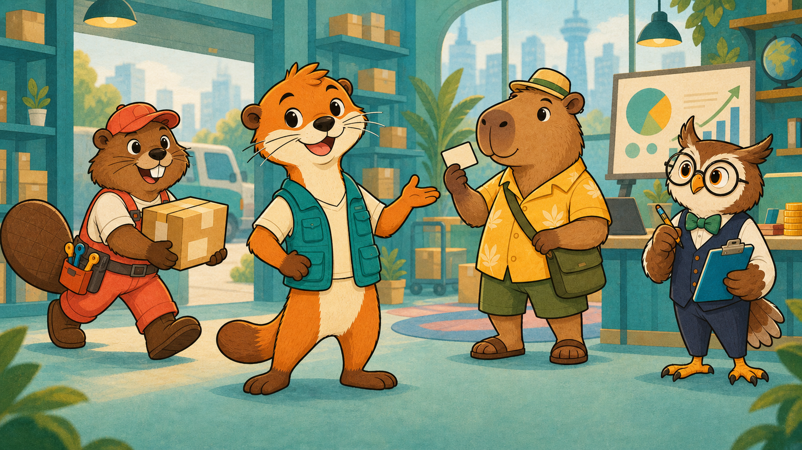
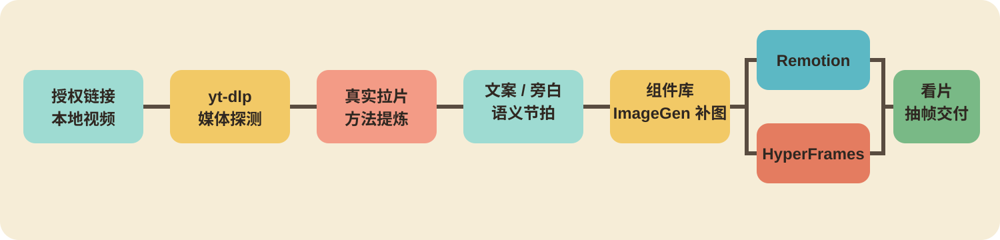

# 二维拼贴知识视频工作流

把一篇知识文案，做成真正有角色、有道具、有关系变化的二维动画视频。

它不是“字幕加背景图”的套壳模板。Agent 会先理解每句话在讲谁、发生什么动作、产生什么结果，再用透明角色、道具、场景、文字和图解把这些关系演出来。

<p align="center">
  
</p>

## 能做出什么

同一份文案和旁白，可以选择两种制作方式：

### Remotion 版本

https://github.com/user-attachments/assets/35ebbbf4-b3e3-4c84-8d92-1e8ffe690117

[▶ 查看 Remotion 1080p 高清版](https://luu175ktovtsvor-spec.github.io/knowledge-video-workflow/#remotion)

### HyperFrames 版本

https://github.com/user-attachments/assets/b6bdad37-ff7e-4d1e-85d3-cd9944a7af9d

[▶ 查看 HyperFrames 1080p 高清版](https://luu175ktovtsvor-spec.github.io/knowledge-video-workflow/#hyperframes)

两版使用相同的角色、道具、字幕和内容节拍，方便直接比较实现效果。仓库还提供 260 个可组合组件，包括 15 个背景、73 个角色姿态、22 个关系群像、42 个场景模块和 108 个道具。[查看组件分类、尺寸边界和使用方法](assets/component-library/README.md)。

适合商业知识、方法讲解、课程内容、案例拆解和其他需要“把抽象概念演出来”的视频。不适合真人口播剪辑、影视短剧或以生成式视频镜头为主的项目。

## 它怎样工作

<p align="center">
  
</p>

```text
参考视频或现有文案 → 提炼表达方法 → 拆成语义动作 → 选择或补充组件 → Remotion / HyperFrames → 看片修改 → MP4
```

画面不会因为章节没变就停住。旁白出现新主体、因果、对比或结果时，角色姿态、道具、关系、景别或状态会随之变化。文字、数字、表格和路径由代码绘制，角色与复杂道具使用透明图片，因此仍然可以修改和复用。

## 四套公开方法

这个仓库不只提供代码和图片，也说明 Agent 应该怎样做判断：

- [参考片怎样拉](references/reference-analysis.md)：从连续观看、时间码记录到提炼可迁移的构图、运动和声音方法；
- [文案怎样变成画面](references/method.md)：把每个意群拆成“观众任务—起点—可见动作—结果”，再决定场景、图解和动画；
- [组件怎样选择和补充](references/assets.md)：区分现有组件、代码图形和需要 ImageGen 补充的透明资产，并完成真实 alpha 与边缘检查。
- [成片怎样排查](references/review.md)：从全片接触页、动作事件帧和高清单帧找到具体时间，再区分源图、容器裁切、动画、遮罩和层级问题。

前三套制作方法汇总到 `collage-plan.json`，第四套复审方法用这份计划反查成片。`collage-plan.json` 是 Agent 制作 Remotion 或 HyperFrames 时共同读取的制作合同，记录旁白锚点、画面目标、组件、层级和动作；它不是一个脱离 Agent 自动生成成片的按钮。

## 下载和安装

本仓库面向能够读取本地 Skills 的 Codex 环境。制作和检查需要以下本机工具：

| 工具 | 用途 | 官方地址 |
|---|---|---|
| Git | 克隆仓库；使用 ZIP 时可不安装 | [git-scm.com/downloads](https://git-scm.com/downloads) |
| Python 3.10+ | 运行工程创建、素材检查和抽帧脚本 | [python.org/downloads](https://www.python.org/downloads/) |
| Node.js 22+ / npm | 安装并运行 Remotion 或 HyperFrames；建议使用当前 LTS | [nodejs.org/download](https://nodejs.org/en/download) |
| FFmpeg / FFprobe | 媒体探测、转码、抽帧和成片检查 | [ffmpeg.org/download](https://ffmpeg.org/download.html) |

选择一种下载方式：

### 使用 Git 安装

```bash
git clone --depth 1 https://github.com/luu175ktovtsvor-spec/knowledge-video-workflow.git \
  "${CODEX_HOME:-$HOME/.codex}/skills/collage-knowledge-video-workflow"
```

### 下载 ZIP

[下载完整 Skill ZIP](https://github.com/luu175ktovtsvor-spec/knowledge-video-workflow/archive/refs/heads/main.zip)。解压后，把文件夹改名为 `collage-knowledge-video-workflow`，再放到 `${CODEX_HOME:-$HOME/.codex}/skills/`。仓库同时包含组件库和演示视频，完整下载包约 240MB。

安装完成后运行环境检查：

```bash
SKILL_DIR="${CODEX_HOME:-$HOME/.codex}/skills/collage-knowledge-video-workflow"
python3 "$SKILL_DIR/scripts/doctor.py"
```

重新打开 Codex 任务，使新 Skill 被发现。更新时建议先把新版下载到新目录并运行 `doctor.py`，确认后再替换旧目录；不要直接覆盖自己改过的文件。

## 安装后怎么开始

可以直接这样说：

```text
请使用 $collage-knowledge-video-workflow 制作一条 16:9 知识视频。
文案在 /path/to/script.md，旁白在 /path/to/narration.wav。
参考视频是 <URL>，只分析它的画面组织和动画方法。
使用 Remotion 制作，成片输出到 /path/to/project/output。
```

如果文案还没有确定，也可以先把允许研究的来源和目标观众告诉 Agent，让它先完成参考分析和文案阶段，再进入制作。

## 旁白和 TTS

这个 Skill 不绑定某一个 TTS，也不把语音模型打包进仓库。你可以在本地安装一个 TTS，也可以接入自己正在使用的语音服务。只要能输出 WAV、MP3 或其他 FFmpeg 可读的旁白音频，Agent 就可以继续生成字幕时间、对齐画面和渲染成片。

旁白声音、模型权重、密钥和生成结果应保存在任务工作区，不进入公开 Skill 仓库。

如果同时提供 SRT，默认只把它当作断句和时间依据，再按当前视频样式生成字幕页；不会直接把原 SRT 烧进画面。只有明确要求保留原字幕文本和分段时才原样显示。

## Remotion 还是 HyperFrames

| 选择 | 更适合 |
|---|---|
| Remotion | React/TypeScript 项目、复杂组件复用、数据驱动画面 |
| HyperFrames | HTML/CSS/GSAP 项目、直接编辑网页式动画、轻量组合 |

两种方式使用同一套语义拆解和组件逻辑。已有 React 技术栈可选 Remotion；更习惯 HTML/CSS/GSAP 时可选 HyperFrames；也可以要求 Agent 同时制作两版进行比较。

## 使用自己的参考视频

仓库通过 yt-dlp 获取你有权下载和研究的参考样本：

```bash
python3 -m pip install yt-dlp
SKILL_DIR="${CODEX_HOME:-$HOME/.codex}/skills/collage-knowledge-video-workflow"
python3 "$SKILL_DIR/scripts/fetch_reference.py" "<URL>" --output-dir /path/to/task/reference
```

需要登录状态时，优先使用 `--cookies-from-browser chrome`，不需要额外安装浏览器扩展。只有确实需要独立 cookie 文件时，才选择自己信任的本地导出工具，把 `cookies.txt` 保存在仓库外，并增加 `--cookies /absolute/path/cookies.txt`。多个样本、播放列表和主页范围见[参考片说明](references/reference-analysis.md)。

## 组件不够怎么办

Agent 会先根据文案列出“主体—动作对象—结果”，再查现有组件库。缺少关键角色姿态、专业场景或复杂道具时，可以调用 Codex ImageGen 或你选择的图像工具补充透明 PNG；不会为了填空而随意堆图。

图片质检按来源分开：已有组件或用户提供图在选择时做输入检查；只有确定缺图并实际调用 ImageGen 后，才对已经生成的文件做出图检查。`scripts/inspect_transparent_assets.py` 要求明确 `component-library`、`user-provided` 或 `imagegen` 来源，再逐张打开浅底/深底预览。没有真实输出文件时，不存在“ImageGen 出图质检通过”。

组件只是画面元素，不是现成镜头。最终排版仍然要根据当前句子的语义、动作方向、遮挡关系和字幕安全区重新组合。完整索引见[组件库说明](assets/component-library/README.md)，制作方法见[语义与构图](references/method.md)和[组件库与补图](references/assets.md)。

## 本地环境

`doctor.py` 会报告实际找到的 Python、Node.js、npm、FFmpeg、FFprobe 和可选 yt-dlp 版本；它不替代 npm 安装，也不判断画面质量。选择一个引擎创建独立工程并完成首次检查。

首次 `npm ci` 需要联网。Remotion 第一次渲染还会自动下载约 94MB 的 Headless Chrome；HyperFrames 默认示例会从 jsDelivr 加载 GSAP。网络受限或需要离线制作时，先准备这些依赖再开始渲染。

```bash
SKILL_DIR="${CODEX_HOME:-$HOME/.codex}/skills/collage-knowledge-video-workflow"
python3 "$SKILL_DIR/scripts/create_project_workspace.py" /path/to/task/remotion --engine remotion
cd /path/to/task/remotion
npm ci
npm run lint
npm run render:starter
```

或者：

```bash
SKILL_DIR="${CODEX_HOME:-$HOME/.codex}/skills/collage-knowledge-video-workflow"
python3 "$SKILL_DIR/scripts/create_project_workspace.py" /path/to/task/hyperframes --engine hyperframes
cd /path/to/task/hyperframes
npm ci
npm run check
npm run render
```

真实文案、旁白、Cookies、下载的参考视频和成片保存在仓库外的任务目录。Agent 的完整执行顺序见 [AGENTS.md](AGENTS.md)。

## 成片怎么检查

先用全片、结尾和逐拍接触页定位裁切、残边、穿模、无逻辑遮挡、长时间不换画面和结尾退化。如果 `collage-plan.json` 含有动作事件，复审页也会抽取动作发生帧。发现可疑时间后，再导出高清单帧细看边缘和遮挡关系，最后连续播放成片。完整方法见[成片与人工复审](references/review.md)。

除非文件另有说明，仓库内容按 [MIT License](LICENSE) 开放使用。
